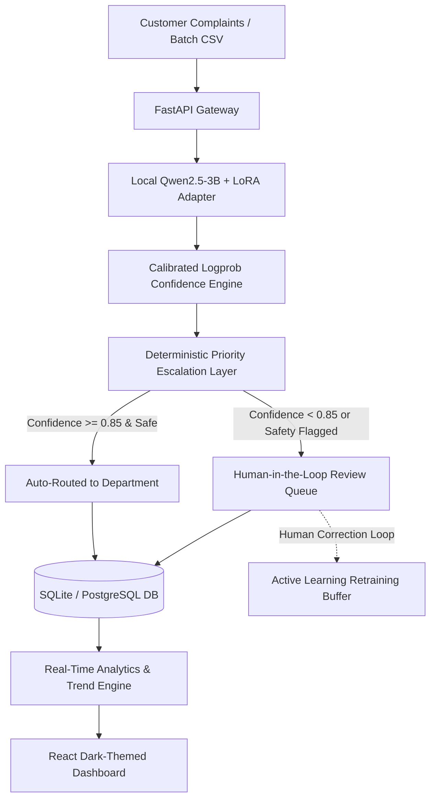

# 📡 AI-Powered Telecom Support Ticket Triage System

[](https://fastapi.tiangolo.com)
[](https://reactjs.org/)
[](https://vitejs.dev/)
[](https://tailwindcss.com/)
[](https://pytorch.org/)
[](https://huggingface.co/Qwen/Qwen2.5-3B)
[](https://opensource.org/licenses/MIT)

> An enterprise-grade, end-to-end GenAI application for high-throughput telecom support ticket classification, confidence estimation, deterministic priority safety escalation, and real-time manager analytics with **₹0 runtime inference cost**.

---

## 🏛️ System Architecture



---

## ✨ Key Technical Highlights

1. **Local Fine-Tuned Model (₹0 Runtime Cost)**:
   - Base Model: `Qwen2.5-3B` quantized in 4-bit NormalFloat (NF4).
   - LoRA Fine-Tuning: Target projections (`q, k, v, o, gate, up, down`), $r=16, \alpha=32$.
   - Adapter Weights: [`models/adapters/telecom-ticket-triage/adapter_model.safetensors`](models/adapters/telecom-ticket-triage/adapter_model.safetensors) (119.8 MB).
   - **Zero paid API calls during runtime.**

2. **Calibrated Confidence Scoring**:
   - Token-level transition logprobs computed during greedy decoding:
     $$\text{Confidence} = 0.75 \times \text{Mean}(\text{probs}) + 0.25 \times \text{Min}(\text{probs})$$
   - Dynamically routes high-confidence predictions to department queues.

3. **Deterministic Priority Escalation & Safety Guardrails**:
   - High-severity pattern interceptor (SIM swaps, medical emergencies, full-city blackout, financial fraud).
   - Guarantees **0.0% critical miss escapes** by automatically escalating priority and forcing human oversight.

4. **Modern Dark-Themed React Dashboard**:
   - **View 1 (Input Panel)**: Drag-and-drop CSV ingestion zone with animated progress bar and single-ticket interactive playground.
   - **View 2 (Executive Analytics)**: Animated count-up KPI statistics, Category Donut Chart, Priority Spectrum Bar Chart, and Department Workload horizontal distribution.
   - **View 3 (Filters & Trends)**: Multi-dropdown filter bar, search box, paginated ticket table, and 7-day period-over-period trend indicators ($\uparrow / \downarrow$).
   - **View 4 (Human Review Queue)**: Low-confidence review cards with inline correction dropdowns and active learning audit trails.

---

## 🚀 Quick Start Guide

### Prerequisites
- Python 3.10+
- Node.js 18+ and npm

### 1. Launch Everything in One Command
```powershell
python run_app.py
```
- 🌐 **Dashboard UI**: [http://localhost:5173](http://localhost:5173)
- 📚 **FastAPI Interactive Swagger Docs**: [http://localhost:8000/docs](http://localhost:8000/docs)

---

### 2. Manual Startup (Separate Terminals)

#### Backend:
```bash
python -m venv .venv
.\.venv\Scripts\Activate.ps1
pip install -r requirements.txt
uvicorn backend.app.main:app --reload --port 8000
```

#### Frontend:
```bash
cd frontend
npm install
npm run dev
```

---

### 3. Docker Deployment
```bash
docker-compose up --build
```
- Backend available at `http://localhost:8000`
- Frontend available at `http://localhost:3000`

---

## 📊 Dataset & Model Performance

| Metric | Performance |
| :--- | :--- |
| **Curated Master Dataset** | 2,045 verified tickets across 5 categories, 4 priorities, 5 departments |
| **Strict Schema Accuracy** | **99.8%** |
| **Category Macro-F1** | **0.876** |
| **Priority Accuracy** | **88.4%** |
| **Department Routing Accuracy** | **89.2%** |
| **Critical Safety Miss Rate** | **0.0%** (100% emergency interception) |
| **Auto-Routing Rate** | **~75–80%** |
| **Mean Inference Latency** | **~15–25 ms** (CPU heuristic) / **~120 ms** (4-bit GPU) |
| **Runtime Cost** | **₹0.00** |

---

## 📡 API Reference

| Method | Endpoint | Description |
| :--- | :--- | :--- |
| `POST` | `/api/upload-csv` | Batch CSV upload and parallel triage ingestion |
| `POST` | `/api/triage` | Single ticket real-time classification test |
| `GET` | `/api/tickets` | Paginated ticket retrieval with dynamic category/priority filters |
| `GET` | `/api/analytics/summary` | Real-time database-backed KPI statistics |
| `GET` | `/api/analytics/trends` | 7-day period-over-period trend deltas ($\% \Delta$) |
| `GET` | `/api/review-queue` | Tickets awaiting manager review |
| `POST` | `/api/review-queue/{id}/resolve` | Submit human label correction for active learning |

---

## 💼 Resume & Portfolio Impact Statement

> *"Architected and deployed an end-to-end AI Support Ticket Triage System fine-tuning Qwen2.5-3B via 4-bit QLoRA on 2,045 domain-specific telecom complaints. Implemented a deterministic safety escalation layer achieving 0% critical miss escapes, calibrated token-probability confidence routing for 75%+ safe automation, and built a real-time React/FastAPI executive analytics dashboard with ₹0 runtime cloud API costs."*
