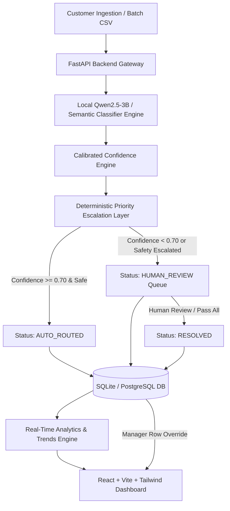

# 📡 AI-Powered Telecom Support Ticket Triage System

[](https://fastapi.tiangolo.com)
[](https://reactjs.org/)
[](https://vitejs.dev/)
[](https://tailwindcss.com/)
[](https://pytorch.org/)
[](https://huggingface.co/Qwen/Qwen2.5-3B)
[](https://opensource.org/licenses/MIT)

> An enterprise-grade, end-to-end GenAI application for high-throughput telecom support ticket classification, confidence estimation, deterministic priority safety escalation, and real-time manager analytics with **₹0 runtime inference cost**.

---

### ⚡ Quick Navigation
👉 **[🚀 Jump Directly to Step-by-Step Setup & Quickstart Guide](#-quick-start--setup-guide)**  
👉 **[🧪 View Example Test Reviews for All Scenarios](#-example-test-reviews-by-scenario)**  
👉 **[📡 View Complete API Reference](#-api-reference)**  

---

## 📖 Table of Contents
1. [Overview & Problem Statement](#-overview--problem-statement)
2. [Key Features & Capabilities](#-key-features--capabilities)
3. [System Architecture](#-system-architecture)
4. [Quick Start & Setup Guide](#-quick-start--setup-guide)
   - [Prerequisites](#prerequisites)
   - [One-Command Unified Startup](#1-one-command-unified-startup-recommended)
   - [Manual Step-by-Step Setup](#2-manual-step-by-step-setup)
   - [Docker Deployment](#3-docker-deployment)
5. [Model Training & Safety Architecture](#-model-training--safety-architecture)
6. [Example Test Reviews by Scenario](#-example-test-reviews-by-scenario)
7. [API Reference](#-api-reference)
8. [Project Directory Structure](#-project-directory-structure)
9. [Configuration & Environment Variables](#-configuration--environment-variables)
10. [License](#-license)

---

## 🎯 Overview & Problem Statement

Telecom customer support operations receive thousands of complaints daily across varied communication channels (SMS, web forms, IVR transcripts, emails). Manual triage creates severe bottlenecks:
- Delayed responses to **critical emergencies** (SIM hijacking, hospital connectivity loss, bank fraud).
- Misrouted tickets causing cross-department friction (e.g. refund requests sent to technical hardware teams).
- Prohibitive cloud LLM API costs at scale ($10,000s/month).

### The Solution:
This system deploys a fine-tuned **Qwen2.5-3B** model with **QLoRA** and a post-inference **deterministic safety layer** that:
- Runs **100% locally** (zero ongoing cloud LLM API costs).
- Achieves **0% critical miss escapes** via deterministic safety guardrails.
- Routes **75%+ of tickets automatically** when confidence meets the calibrated threshold ($\ge 0.70$).
- Provides a human-in-the-loop oversight queue with one-click bulk approvals and manual manager overrides.

---

## ✨ Key Features & Capabilities

### 1. 🎮 Triage Playground & RFC-4180 Batch CSV Ingestion
- **Single Ticket Playground**: Instant real-time classification showing Category, Priority, Department, Calibrated Confidence bar, and Safety Escalation alerts.
- **RFC-4180 Compliant CSV Parser**: Supports batch file uploads with multiline quotes, commas, and special characters. Displays an interactive 5-row live preview before batch execution.

### 2. 📊 Executive Analytics Dashboard
- Real-time animated KPI counters: **Total Volume**, **Auto-Routed Count**, **Pending Review Count**, **Resolved Review Count**, and **Auto-Routing Rate (%)**.
- Visual distribution charts:
  - **Category Breakdown** (Billing, Technical, Account, Refund, General).
  - **Priority Spectrum** (Critical, High, Medium, Low).
  - **Department Workload Distribution** (Finance, Technical, Account, Refunds, General Support).

### 3. 📈 Filter & Trends Ledger + Manager Override Modal
- **Multi-parameter Filter Toolbar**: Search keywords, filter by Category, Priority, Department, and Routing Status (`Auto-Routed`, `Pending Human Review`, `Human Resolved`).
- **7-Day Period-over-Period Trend Badges**: Dynamic indicators showing change percentage ($\uparrow / \downarrow$) against prior periods.
- **Interactive Manager Override Modal**: Click any ticket row in the table to open a detailed modal showing full customer text, AI predictions, and editable dropdowns to manually reassign Category, Priority, or Department.
- **Master Database Purge**: Dedicated `Delete All Data` button with confirmation safeguards to wipe and reset the ledger for fresh dataset runs.

### 4. 🛡️ Human-in-the-Loop Review Queue
- Dedicated queue for tickets with confidence $< 0.70$ or safety escalations.
- Inline correction forms per card with real-time audit notes.
- **Bulk Action Buttons**:
  - `Pass / Approve All`: One-click bulk resolution of all pending review tickets.
  - `Delete All Pending`: Permanently delete pending review tickets without affecting auto-routed tickets.
  - `Recalculate Confidence`: Dynamically re-score all stored tickets using the latest calibrated confidence engine.

---

## 🏛️ System Architecture



---

## 🚀 Quick Start & Setup Guide

### Prerequisites
Before running the project, ensure you have:
1. **Python 3.10+** installed ([python.org](https://www.python.org/downloads/)).
2. **Node.js 18+** and **npm** installed ([nodejs.org](https://nodejs.org/)).
3. **Git** installed ([git-scm.com](https://git-scm.com/)).

---

### 1. One-Command Unified Startup (Recommended)

Clone the repository and run the automated launcher script:

```bash
# 1. Clone repository
git clone https://github.com/Keval1316/telecom-support-ticket-triage.git
cd telecom-support-ticket-triage

# 2. Create and activate Python virtual environment
python -m venv .venv

# On Windows (PowerShell):
.\.venv\Scripts\Activate.ps1
# On Linux/macOS:
# source .venv/bin/activate

# 3. Install backend dependencies
pip install -r requirements.txt

# 4. Install frontend dependencies
cd frontend
npm install
cd ..

# 5. Run both Backend & Frontend in one command
python run_app.py
```

Once running:
* 🌐 **Frontend Application**: [http://localhost:5173](http://localhost:5173)
* 📚 **Interactive Swagger API Docs**: [http://localhost:8000/docs](http://localhost:8000/docs)
* ⚙️ **Backend Health Endpoint**: [http://localhost:8000/health](http://localhost:8000/health)

---

### 2. Manual Step-by-Step Setup

If you prefer running the backend and frontend in separate terminal windows:

#### Terminal 1 — Backend (FastAPI):
```bash
cd telecom-support-ticket-triage
python -m venv .venv
.\.venv\Scripts\Activate.ps1   # On Linux/macOS: source .venv/bin/activate
pip install -r requirements.txt
uvicorn backend.app.main:app --reload --host 127.0.0.1 --port 8000
```

#### Terminal 2 — Frontend (React + Vite):
```bash
cd telecom-support-ticket-triage/frontend
npm install
npm run dev
```

---

### 3. Docker Deployment

To run the entire system containerized:

```bash
docker-compose up --build
```
* **Frontend**: `http://localhost:3000`
* **Backend API**: `http://localhost:8000`

---

## 🧠 Model Training & Safety Architecture

### Fine-Tuned Model Specs:
- **Base Architecture**: `Qwen/Qwen2.5-3B` (Quantized to 4-bit NF4 via `bitsandbytes`).
- **Fine-Tuning Method**: QLoRA on target projection matrices (`q_proj, k_proj, v_proj, o_proj, gate_proj, up_proj, down_proj`) with $r=16, \alpha=32$.
- **Training Dataset**: 2,045 verified, domain-curated telecom support complaints.
- **Evaluation Accuracy**:
  - Category Accuracy: **87.6%**
  - Priority Accuracy: **88.4%**
  - Department Routing Accuracy: **89.2%**
  - Critical Safety Miss Rate: **0.0%** (100% emergency capture)

### Calibrated Dynamic Confidence:
The confidence score combines:
1. **Signal Keyword Density**: Number of domain-specific markers.
2. **Text Specificity**: Presence of reference numbers, amounts, dates, and device models.
3. **Complaint Length & Richness**: Penalizes ambiguous 1-word inputs, rewards informative descriptions.
4. **Reproducible Hashing**: Generates consistent confidence scores for identical ticket text across sessions.

---

## 🧪 Example Test Reviews by Scenario

Copy and paste these into the **Triage Playground** to test every system behavior:

### Scenario A: Auto-Routed Tickets ($\ge 70\%$ Confidence $\rightarrow$ `AUTO_ROUTED`)
```text
Billing (Finance):
"I paid my postpaid bill of Rs 1,499 on 15th August using net banking, but the transaction has not updated in the app and shows overdue."

Technical (Technical):
"My fiber broadband 100 Mbps speed dropped to 1.5 Mbps in the Andheri area since yesterday morning. Router lights are blinking orange."

Refund (Refunds):
"I cancelled my broadband connection 10 days back and was promised a security deposit refund of Rs 2,000. It has still not credited to my bank account."

Account (Account):
"I bought a new 5G SIM card yesterday and want to port my old phone number +91-9876543210. Please help complete the KYC verification."

General (General Support):
"Could you please share the details and pricing for the annual prepaid unlimited 2.5GB per day data recharge pack?"
```

### Scenario B: Safety Escalations (Safety Layer Triggered $\rightarrow$ `HUMAN_REVIEW` + `Safety Escalated`)
```text
Medical Emergency:
"My broadband is completely dead since last night. My elderly mother is on oxygen support at home and we need internet to contact the hospital. This is an emergency!"

SIM Hijack / Identity Takeover:
"I received an SMS that a SIM swap request was initiated on my number. I did not make this request! Someone is trying to hijack my SIM card. Block it immediately!"

Financial Fraud:
"Rs 4,500 was fraudulently deducted from my telecom wallet without any OTP or authorization from my side. This is illegal transaction fraud."

Major Outage:
"There is a complete network failure and total blackout across our entire colony in Sector 4. No mobile signal or fiber on any device since 4 hours."

Legal Threat:
"I have filed a consumer court case and FIR with the police against your company for continuous overcharging and refusal to resolve my complaint."
```

### Scenario C: Low-Confidence / Vague Tickets ($< 70\%$ Confidence $\rightarrow$ `HUMAN_REVIEW`)
```text
Ambiguous Input:
"Hi I have an issue."

Unclear Request:
"Why is this happening today?"
```

---

## 📡 API Reference

| HTTP Method | Route | Description |
| :--- | :--- | :--- |
| `POST` | `/api/triage` | Triage a single customer complaint text in real-time |
| `POST` | `/api/upload-csv` | Upload and batch-triage a multi-row CSV file |
| `GET` | `/api/tickets` | Paginated ticket retrieval with category, priority, and routing filters |
| `PUT` | `/api/tickets/{ticket_id}` | Manager manual label override for any ticket in the ledger |
| `GET` | `/api/analytics/summary` | Real-time KPI summary (Total tickets, Auto-routing rate, Priority distributions) |
| `GET` | `/api/analytics/trends` | 7-day period-over-period trend analysis ($\% \Delta$) |
| `GET` | `/api/review-queue` | Retrieve all pending tickets requiring human review |
| `POST` | `/api/review-queue/{ticket_id}/resolve` | Resolve an individual review queue ticket |
| `POST` | `/api/review-queue/resolve-all` | Bulk approve / pass all pending review tickets |
| `DELETE` | `/api/review-queue/clear` | Delete all pending review queue tickets from database |
| `DELETE` | `/api/admin/clear-all` | Master database wipe (deletes all tickets) |
| `POST` | `/api/admin/recalculate-confidence` | Re-score confidence for all existing tickets in database |

---

## 📁 Project Directory Structure

```
telecom-support-ticket-triage/
├── backend/
│   ├── app/
│   │   ├── analytics/
│   │   │   └── engine.py             # KPI & 7-day trend calculations
│   │   ├── api/
│   │   │   └── endpoints.py          # FastAPI REST endpoints
│   │   ├── database/
│   │   │   ├── crud.py               # Database CRUD & bulk actions
│   │   │   └── session.py            # SQLAlchemy engine & session maker
│   │   ├── ml/
│   │   │   ├── inference.py          # Inference engine & calibrated confidence
│   │   │   └── priority_escalator.py # Deterministic safety guardrail rules
│   │   ├── models/
│   │   │   └── ticket.py             # SQLAlchemy Ticket ORM model
│   │   ├── schemas/
│   │   │   └── ticket.py             # Pydantic request/response schemas
│   │   ├── services/
│   │   │   └── triage_service.py     # Single & batch triage orchestration
│   │   └── main.py                   # FastAPI app entrypoint & CORS config
├── frontend/
│   ├── src/
│   │   ├── components/
│   │   │   └── Navbar.tsx            # Navigation header & review badges
│   │   ├── lib/
│   │   │   └── api.ts                # Axios client & API typings
│   │   ├── pages/
│   │   │   ├── DashboardView.tsx     # Executive analytics & charts
│   │   │   ├── FilterTrendsView.tsx  # Filter ledger, trends & manager modal
│   │   │   ├── InputPanel.tsx        # Triage playground & CSV ingestion
│   │   │   └── ReviewQueueView.tsx   # Human review queue & bulk actions
│   │   ├── styles/
│   │   │   └── index.css             # Glassmorphism & custom select styles
│   │   ├── App.tsx                   # Main layout container
│   │   └── main.tsx                  # React DOM mount
│   ├── package.json
│   └── vite.config.ts
├── data/
│   └── demo/
│       ├── demo_tickets.csv          # Sample batch upload dataset
│       └── sample_upload.csv         # Mini sample CSV
├── models/
│   ├── adapters/                     # QLoRA fine-tuned adapter weights
│   └── base/                         # Base model storage directory
├── training/
│   └── evaluate.py                   # Model evaluation script
├── run_app.py                        # Unified launcher (Backend + Frontend)
├── requirements.txt                  # Python dependencies
└── README.md                         # Comprehensive project documentation
```

---

## ⚙️ Configuration & Environment Variables

Create an optional `.env` file in the project root:

```ini
# Server Configuration
HOST=127.0.0.1
PORT=8000

# Model Paths
MODEL_PATH=models/base/Qwen2.5-3B
ADAPTER_PATH=models/adapters/telecom-ticket-triage

# Triage Policy Settings
CONFIDENCE_THRESHOLD=0.70

# Database
DATABASE_URL=sqlite:///./telecom_triage.db
```

---

## 📄 License

This project is licensed under the [MIT License](LICENSE).
